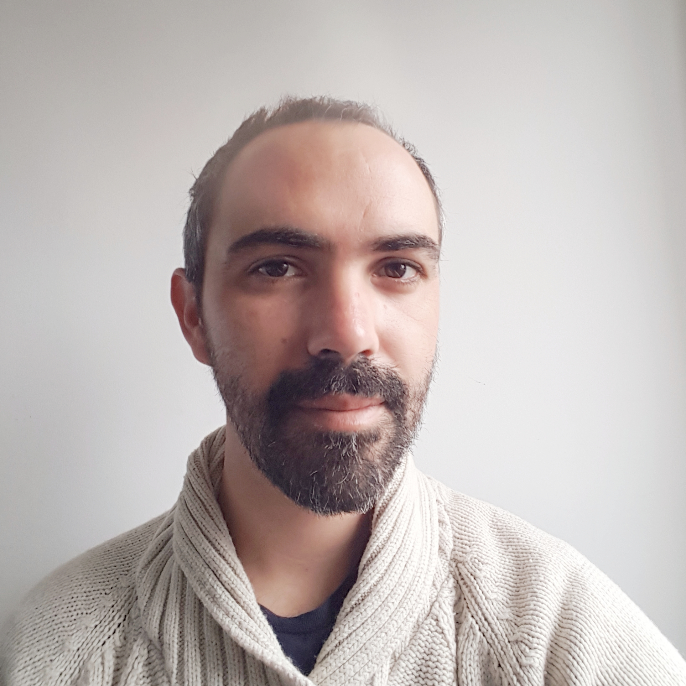

<section id="hero" class="section ">
  

    

      

          
        

      

      <h3>Welcome to my website</h3>
        

        
        I am a researcher in <a href="https://www.qmul.ac.uk/">Queen Mary University of London</a>, working in the <a href="http://antennas.eecs.qmul.ac.uk/">Antennas and  Electromagnetics research group</a>. 
        

        

        You will find here everything about my work, including past and current research projects and publications.
        You can also read posts I published on my blog as well as some information about me and my research interests.
        If you are interested in all this, do not hesitate to contact me!
        

        <!-- hero --> 
      

    

  

    <a href="{{ site.baseurl }}/research" class="btn btn-default">Research</a>
    <a href="{{ site.baseurl }}/publications" class="btn btn-default">Publications</a>
    <a href="{{ site.baseurl }}/about"  class="btn btn-default">About me</a>
    <a href="{{ site.baseurl }}/contact"  class="btn btn-default">Get in touch</a>
    <a href="{{ site.baseurl }}/projects/News"  class="btn btn-default">Browse latest news</a>

</section>
